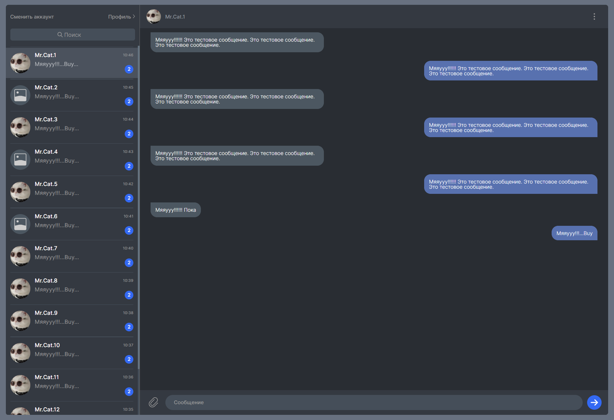
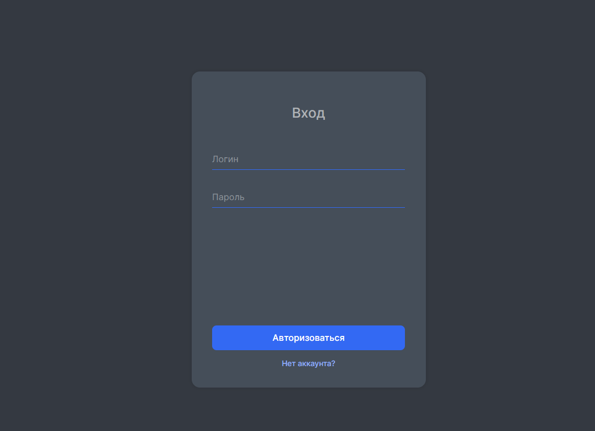

## Описание:

###
#### Это учебный проект «Яндекс.Практикума» по курсу «Мидл фронтенд-разработчик». 
##
 - [ссылка на проект в Netlify](https://endearing-boba-eb1973.netlify.app/) 
 - [ссылка на макет в figma](https://www.figma.com/file/5EXKBt4MSSpbgsNjwKQVg7/messenger-ya-praktikum-course?node-id=0%3A1&t=x4gbiYken5G2nTRf-1)

##
переход на страницы приложения по списку из корня сайта либо по навигации внутри страниц
##
во время деплоя выяснилось что parcel в production обнуляет файл svg спрайта, так что все иконки пока только в dev режиме
####Команды для управления проектом:

- `npm install` - установка зависимостей.
- `npm run dev` - запуск проекта в режиме разработки.
- `npm run build` - запуск сборки проекта.
- `npm run start` - сборка проекта и запуск сервера на потрту 3000.

##

##

